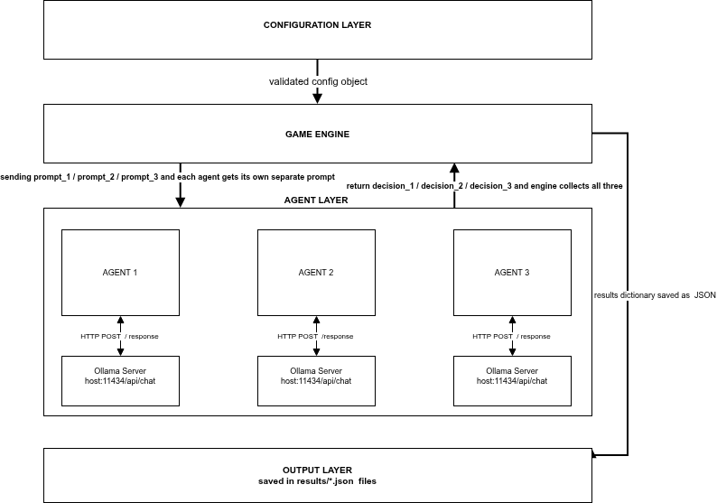

# IPD-LLM-Agents3

A three-agent Iterated Prisoner's Dilemma simulation using open-source Large Language Model agents. Three LLMs from different model families Llama3-8B, Gemma2-9B, and Mistral-7B  play a repeated cooperation game across multiple episodes, produce natural language reasoning for every decision, write strategic reflections between episodes, and have all results stored in a PostgreSQL database for analysis.

This project extends IPD-LLM-Agents2 (two-agent) to three agents 

---

## Key Results

| Group | Composition | Mean Cooperation Rate |
|---|---|---|
| 3G | Gemma2 - Gemma2 - Gemma2 | **100.0%** |
| 3L | Llama3 - Llama3 - Llama3 | 74.3% |
| 2L+1G | Llama3 - Llama3 - Gemma2 | 61.5% |
| 2L+1M | Llama3 - Llama3 - Mistral | 49.5% |
| 1L+1M+1G | Llama3 - Mistral - Gemma2 | 41.6% |
| 2G+1L | Gemma2 - Gemma2 - Llama3 | 38.2% |

79 experiment runs total. Model composition identity accounts for **82.5%** of predictive importance (SHAP). Gradient Boosting cross-validation R² = **0.6835**.

---

## System Architecture

The simulation is organised into four layers:

- **Configuration Layer** — `EpisodeConfig` validates all game parameters and passes a config object to the engine.
- **Game Engine** — `EpisodicIPDGame` drives the episode/round loop, dispatches individual prompts to each agent, collects the three decisions, and scores each round.
- **Agent Layer** — Three `OllamaAgent` instances each communicate with their Ollama server via HTTP POST to `/api/chat`. Each agent maintains its own conversation history.
- **Output Layer** — The full results dictionary is serialised to a timestamped JSON file in `results/`.



---

## Project Structure

```
IPD-LLM-Agents3/
├── config.py                          # EpisodeConfig dataclass — all game parameters
├── episodic_ipd_game.py               # Main game loop — episodes, rounds, JSON output
├── forgedb.py                         # Database interface — writes results to PostgreSQL
├── ollama_agent.py                    # LLM agent wrapper — Ollama HTTP API calls
├── prompts.py                         # Prompt formatting, reflection templates, decision extractor
├── system_prompt.txt                  # Default system prompt (neutral framing)
├── system_prompt_moral.txt            # Moral framing variant
├── system_prompt_selfinterest.txt     # Self-interest framing variant
├── reflection_prompt_template.txt     # Custom reflection template (optional)
├── images/
│   └── architect2.png                 # System architecture diagram
├── analysis_plots_final_code.ipynb    # EDA and visualisation notebook
├── database_insertion_final.ipynb     # ETL notebook — JSON → PostgreSQL
├── json_csv.ipynb                     # CSV export notebook — PostgreSQL views → CSV
│
├── csv_output/
│   ├── enriched_registry.csv          # Primary analytical dataset (79 rows × 27 columns)
│   ├── episode_level.csv              # Episode-level aggregates per agent per run
│   ├── round_level_with_text.csv      # Round-level data including reasoning text
│   └── round_level_no_text.csv        # Round-level data without text columns
│
├── database/
│   └── setup_forge_db3.sql            # PostgreSQL schema — ipd3 tables and views
│
├── ipd_ml_env/
│   └── ml_analysis_final_code.ipynb   # ML pipeline — 8 models, GridSearchCV, SHAP
│
└── results/
    ├── B2_Combined_RoBERTa_Trajectory_Coop_2_1.png   # Sentiment trajectory + cooperation rate
    ├── CR1_01_coop_heatmaps_12_1.png                 # Cooperation rate heatmaps (all 6 groups)
    ├── MFT02_heatmap_coop_26_1.png                   # Moral foundations heatmap
    ├── MFT02_heatmap_coop_27_1.png                   # Moral foundations heatmap with coop bar
    ├── ml01_shap_summary_final_32.png                 # SHAP feature importance bar chart
    ├── TH04A_box_by_temperature_HW10_24_1.png        # Temperature effect boxplot (HW=10)
    └── TH04B_box_by_hw_Temp0.2_24_1.png              # History window effect boxplot (T=0.2)
```

---

## Game Setup

### Payoff Structure

Three agents play simultaneously each round. Each agent earns a payoff based on its own action and how many of the other two agents cooperate (k_C):

| Your Action | k_C = 0 | k_C = 1 | k_C = 2 |
|---|---|---|---|
| COOPERATE | 0 pts | 1 pt | **3 pts** |
| DEFECT | 1 pt | 2 pts | **5 pts** |

Standard IPD values: T=5, R=3, P=1, S=0. Constraints T > R > P > S and 2R > T + S are satisfied.

### Episode Structure

- Each run: 50 episodes × 20 rounds = 1,000 rounds total
- Each round: all three agents receive their history window and produce reasoning + decision
- Each episode end: all three agents write a strategic reflection
- Reflections are injected into the next episode's context (when `reset_conversation_between_episodes=True`)

---

## Setup

### Requirements

- Python 3.12+
- [Ollama](https://ollama.com/) running locally or on a reachable host
- PostgreSQL (for database storage)
- GPU with enough VRAM for the chosen models (8B–9B models require approximately 6–8 GB each)

### Install dependencies

```bash
python -m venv ipd_ml_env
source ipd_ml_env/bin/activate
pip install requests psycopg2-binary pandas scikit-learn shap matplotlib seaborn transformers torch
```

### Pull models via Ollama

```bash
ollama pull llama3:8b-instruct-q5_K_M
ollama pull gemma2:9b-instruct
ollama pull mistral:7b-instruct
```

### Set up the database

```bash
psql -U postgres -f database/setup_forge_db3.sql
```

---

## Running an Experiment

Run directly from the command line — no code changes needed:

```bash
# Quickstart with all defaults
python episodic_ipd_game.py

# Study configuration used in the paper
python episodic_ipd_game.py \
  --episodes 50 \
  --rounds 20 \
  --temperature 0.7 \
  --history-window 10 \
  --model-0 llama3:8b-instruct-q5_K_M --host-0 localhost \
  --model-1 gemma2:9b-instruct         --host-1 localhost \
  --model-2 mistral:7b-instruct        --host-2 localhost \
  --reflection-type standard

# Example: high-temperature run with detailed reflection
python episodic_ipd_game.py \
  --episodes 50 --temperature 1.0 --history-window 5 \
  --reflection-type detailed --quiet
```

Results are saved automatically as `results/3agent_game_YYYYMMDD_HHMMSS.json`.

---

## Configuration Options

All flags for `episodic_ipd_game.py`:

| Flag | Default | Description |
|---|---|---|
| `--episodes` | `5` | Number of episodes per run |
| `--rounds` | `20` | Rounds within each episode |
| `--temperature` | `0.7` | LLM sampling temperature (0.2 / 0.7 / 1.0 used in study) |
| `--history-window` | `10` | Recent rounds shown to agent (5 / 10 / 20 used in study) |
| `--model-0/1/2` | `llama3:8b-instruct-q5_K_M` | Model for each of the three agents |
| `--host-0/1/2` | `tungsten` | Ollama host for each agent |
| `--no-reset` | off | Keep conversation context across episodes |
| `--reflection-type` | `standard` | `minimal` / `standard` / `detailed` |
| `--system-prompt` | `system_prompt.txt` | Path to system prompt file |
| `--reflection-template` | `reflection_prompt_template.txt` | Path to custom reflection template |
| `--output` | auto-timestamped | Override output JSON path |
| `--decision-tokens` | `256` | Max tokens for round decision |
| `--reflection-tokens` | `1024` | Max tokens for episode reflection |
| `--http-timeout` | `60` | Ollama request timeout in seconds |
| `--force-retries` | `2` | Retries if decision cannot be extracted |
| `--comment` | — | Freetext note embedded in the output JSON |
| `--quiet` | off | Suppress per-round console output |

---

## Loading Results to Database

Open `database_insertion_final.ipynb` and run all cells. It reads all JSON files from `results/`, validates them, and inserts them into the `ipd3` PostgreSQL schema.

The schema contains:

| Table | Description |
|---|---|
| `ipd3.results` | One row per experiment run |
| `ipd3.llm_agents` | One row per agent per run |
| `ipd3.episodes` | One row per agent per episode |
| `ipd3.rounds` | One row per agent per round |

Five analytical SQL views: `results_vw`, `experiment_summary_vw`, `episode_summary_vw`, `rounds_summary_vw`, `rounds_detail_vw`.

To export from the database to CSV, run `json_csv.ipynb`.

---

## Analysis

### Primary Dataset

`csv_output/enriched_registry.csv` — 79 rows × 27 columns. Each row is one experiment run. Target variable: `mean_group_coop_rate`.

### Machine Learning

Open `ipd_ml_env/ml_analysis_final_code.ipynb`. The notebook runs 8 regression models (Ridge, Lasso, ElasticNet, RandomForest, ExtraTrees, GradientBoosting, AdaBoost, SVR) with GridSearchCV hyperparameter tuning and five-fold cross-validation, then applies SHAP TreeExplainer to the best model.

Best result: **GradientBoosting — CV R² = 0.6835** (n_estimators=50, learning_rate=0.2, max_depth=2, subsample=0.7, min_samples_leaf=5)

SHAP attribution:
- Model identity features: **82.5%** of importance
- Game configuration (temperature, history window, reset, retries): **17.5%**

### Sentiment Analysis

Episode reflections were scored using `cardiffnlp/twitter-roberta-base-sentiment-latest` (three-class: positive / neutral / negative). Compound score = P(positive) − P(negative).

| Group | Mean Sentiment | Cooperation Rate |
|---|---|---|
| 3Gemma | +0.97 | 100.0% |
| 3Llama | +0.55 | 74.3% |
| 2G+1L | −0.17 | 38.2% |

### Moral Foundations Theory

Reflection texts were scored against the extended Moral Foundations Dictionary for six foundations. Loyalty/Betrayal dominates every group (83.5–104.4 per 1,000 words), consistent with the trust-and-betrayal structure of the game.

---

## Experimental Findings

**Temperature effect** (history window fixed at 10):
- 3Gemma: 100% at all temperatures — fully immune
- 3Llama: drops from 94.4% at T=0.2 to 70.9% at T=1.0
- 2G+1L: collapses from 83.4% at T=0.2 to 18.0% at T=0.7 — most volatile group
- Mistral-containing groups: the only groups that increase cooperation with higher temperature

**History window effect** (temperature fixed at 0.2):
- HW=10 is the optimum for 5 of 6 groups simultaneously
- 2G+1L gains 63.5 percentage points from HW=5 to HW=10 — largest single gain in the study
- 1L+1M+1G is the only group harmed by longer memory — falls to 17.7% at HW=20

**Homogeneous vs heterogeneous**:
- Homogeneous groups (3G, 3L) average: **87.2%**
- Heterogeneous groups average: **47.7%**
- Gap: **39.5 percentage points**

---

## Files Reference

| File | Purpose |
|---|---|
| `config.py` | All game parameters and payoff formula |
| `prompts.py` | Prompt formatting and decision extraction |
| `ollama_agent.py` | HTTP calls to Ollama, handles retries |
| `episodic_ipd_game.py` | Main simulation loop |
| `forgedb.py` | PostgreSQL write interface |
| `database/setup_forge_db3.sql` | Full schema with tables and views |
| `database_insertion_final.ipynb` | JSON → database ETL |
| `json_csv.ipynb` | Database views → CSV export |
| `analysis_plots_final_code.ipynb` | EDA and all visualisation charts |
| `ipd_ml_env/ml_analysis_final_code.ipynb` | Full ML + SHAP analysis |
| `csv_output/enriched_registry.csv` | 79-row primary analytical dataset |

---


