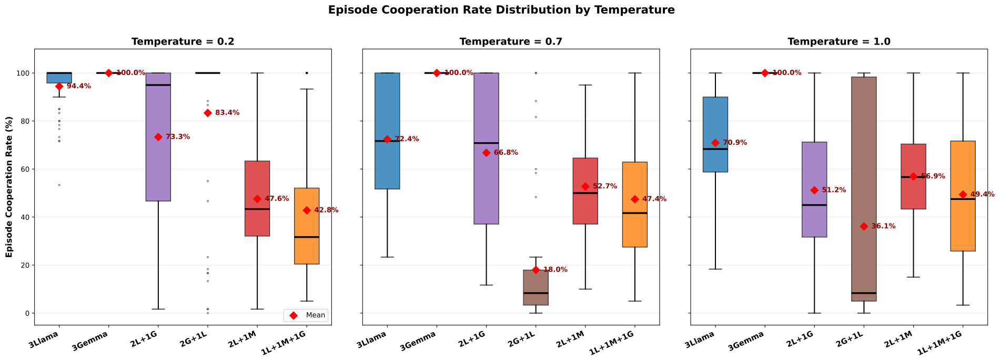
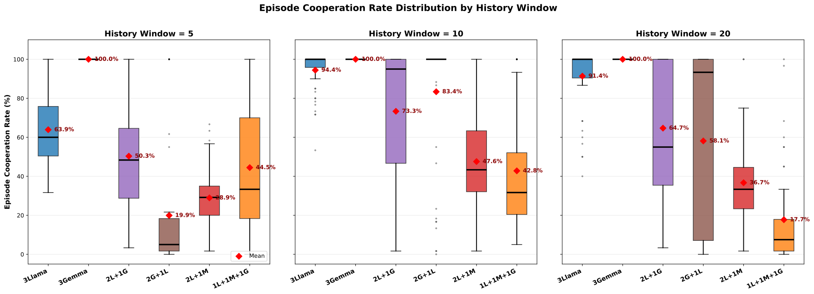
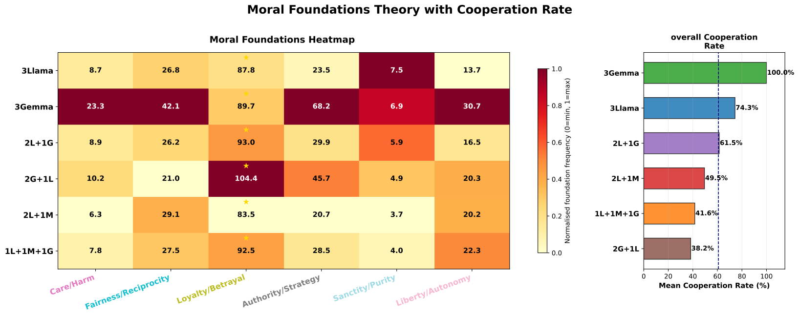
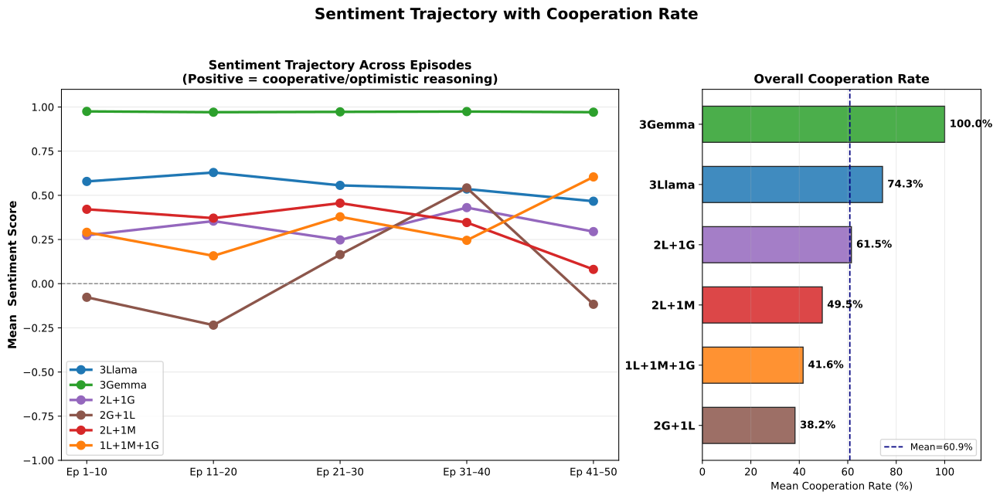
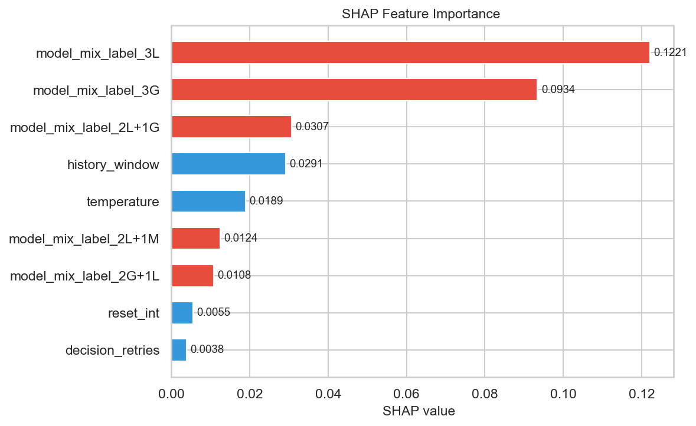

# IPD-LLM-Agents3

A three-agent Iterated Prisoner's Dilemma simulation using open-source Large Language Model agents. Three LLMs from different model families Llama3-8B, Gemma2-9B, and Mistral-7B  play a repeated cooperation game across multiple episodes, produce natural language reasoning for every decision, write strategic reflections between episodes, and have all results stored in a PostgreSQL database for analysis.

This project extends IPD-LLM-Agents2 (two-agent) to three agents 

---

## Key Results

| Group | Composition | Mean Cooperation Rate |
|---|---|---|
| 3G | Gemma2 - Gemma2 - Gemma2 | **100.0%** |
| 3L | Llama3 - Llama3 - Llama3 | 74.3% |
| 2L+1G | Llama3 - Llama3 - Gemma2 | 61.5% |
| 2L+1M | Llama3 - Llama3 - Mistral | 49.5% |
| 1L+1M+1G | Llama3 - Mistral - Gemma2 | 41.6% |
| 2G+1L | Gemma2 - Gemma2 - Llama3 | 38.2% |

79 experiment runs total. Model composition identity accounts for **82.5%** of predictive importance (SHAP). Gradient Boosting cross-validation R² = **0.6835**.

---

## System Architecture

The simulation is organised into four layers:

- **Configuration Layer** — `EpisodeConfig` validates all game parameters and passes a config object to the engine.
- **Game Engine** — `EpisodicIPDGame` drives the episode/round loop, dispatches individual prompts to each agent, collects the three decisions, and scores each round.
- **Agent Layer** — Three `OllamaAgent` instances each communicate with their Ollama server via HTTP POST to `/api/chat`. Each agent maintains its own conversation history.
- **Output Layer** — The full results dictionary is serialised to a timestamped JSON file in `results/`.


---

## Project Structure

```
IPD-LLM-Agents3/
├── config.py                          # EpisodeConfig dataclass — all game parameters
├── episodic_ipd_game.py               # Main game loop — episodes, rounds, JSON output
├── forgedb.py                         # Database interface — writes results to PostgreSQL
├── ollama_agent.py                    # LLM agent wrapper — Ollama HTTP API calls
├── prompts.py                         # Prompt formatting, reflection templates, decision extractor
├── system_prompt.txt                  # Default system prompt (neutral framing)
├── system_prompt_moral.txt            # Moral framing variant
├── system_prompt_selfinterest.txt     # Self-interest framing variant
├── reflection_prompt_template.txt     # Custom reflection template (optional)
├── images/
│   └── architect2.png                 # System architecture diagram
├── analysis_plots_final_code.ipynb    # EDA and visualisation notebook
├── database_insertion_final.ipynb     # ETL notebook — JSON → PostgreSQL
├── json_csv.ipynb                     # CSV export notebook — PostgreSQL views → CSV
│
├── csv_output/
│   ├── enriched_registry.csv          # Primary analytical dataset (79 rows × 27 columns)
│   ├── episode_level.csv              # Episode-level aggregates per agent per run
│   ├── round_level_with_text.csv      # Round-level data including reasoning text
│   └── round_level_no_text.csv        # Round-level data without text columns
│
├── database/
│   └── setup_forge_db3.sql            # PostgreSQL schema — ipd3 tables and views
│
├── ipd_ml_env/
│   └── ml_analysis_final_code.ipynb   # ML pipeline — 8 models, GridSearchCV, SHAP
│
└── results/
    ├── B2_Combined_RoBERTa_Trajectory_Coop_2_1.png   # Sentiment trajectory + cooperation rate
    ├── CR1_01_coop_heatmaps_12_1.png                 # Cooperation rate heatmaps (all 6 groups)
    ├── MFT02_heatmap_coop_26_1.png                   # Moral foundations heatmap
    ├── MFT02_heatmap_coop_27_1.png                   # Moral foundations heatmap with coop bar
    ├── ml01_shap_summary_final_32.png                 # SHAP feature importance bar chart
    ├── TH04A_box_by_temperature_HW10_24_1.png        # Temperature effect boxplot (HW=10)
    └── TH04B_box_by_hw_Temp0.2_24_1.png              # History window effect boxplot (T=0.2)
```

---

## Game Setup

### Payoff Structure

Three agents play simultaneously each round. Each agent earns a payoff based on its own action and how many of the other two agents cooperate (k_C):

| Your Action | k_C = 0 | k_C = 1 | k_C = 2 |
|---|---|---|---|
| COOPERATE | 0 pts | 1 pt | **3 pts** |
| DEFECT | 1 pt | 2 pts | **5 pts** |

Standard IPD values: T=5, R=3, P=1, S=0. Constraints T > R > P > S and 2R > T + S are satisfied.

### Episode Structure

- Each run: 50 episodes × 20 rounds = 1,000 rounds total
- Each round: all three agents receive their history window and produce reasoning + decision
- Each episode end: all three agents write a strategic reflection
- Reflections are injected into the next episode's context (when `reset_conversation_between_episodes=True`)

---

## Setup

### Requirements

- Python 3.12+
- [Ollama](https://ollama.com/) running locally or on a reachable host
- PostgreSQL (for database storage)
- GPU with enough VRAM for the chosen models (8B–9B models require approximately 6–8 GB each)

### Install dependencies

```bash
python -m venv ipd_ml_env
source ipd_ml_env/bin/activate
pip install requests psycopg2-binary pandas scikit-learn shap matplotlib seaborn transformers torch
```

### Pull models via Ollama

```bash
ollama pull llama3:8b-instruct-q5_K_M
ollama pull gemma2:9b-instruct
ollama pull mistral:7b-instruct
```

### Set up the database

```bash
psql -U postgres -f database/setup_forge_db3.sql
```

---

## Running an Experiment

Run directly from the command line — no code changes needed:

```bash
# Quickstart with all defaults
python episodic_ipd_game.py

# Study configuration used in the paper
python episodic_ipd_game.py \
  --episodes 50 \
  --rounds 20 \
  --temperature 0.7 \
  --history-window 10 \
  --model-0 llama3:8b-instruct-q5_K_M --host-0 localhost \
  --model-1 gemma2:9b-instruct         --host-1 localhost \
  --model-2 mistral:7b-instruct        --host-2 localhost \
  --reflection-type standard

# Example: high-temperature run with detailed reflection
python episodic_ipd_game.py \
  --episodes 50 --temperature 1.0 --history-window 5 \
  --reflection-type detailed --quiet
```

Results are saved automatically as `results/3agent_game_YYYYMMDD_HHMMSS.json`.

---

## Configuration Options

All flags for `episodic_ipd_game.py`:

| Flag | Default | Description |
|---|---|---|
| `--episodes` | `5` | Number of episodes per run |
| `--rounds` | `20` | Rounds within each episode |
| `--temperature` | `0.7` | LLM sampling temperature (0.2 / 0.7 / 1.0 used in study) |
| `--history-window` | `10` | Recent rounds shown to agent (5 / 10 / 20 used in study) |
| `--model-0/1/2` | `llama3:8b-instruct-q5_K_M` | Model for each of the three agents |
| `--host-0/1/2` | `tungsten` | Ollama host for each agent |
| `--no-reset` | off | Keep conversation context across episodes |
| `--reflection-type` | `standard` | `minimal` / `standard` / `detailed` |
| `--system-prompt` | `system_prompt.txt` | Path to system prompt file |
| `--reflection-template` | `reflection_prompt_template.txt` | Path to custom reflection template |
| `--output` | auto-timestamped | Override output JSON path |
| `--decision-tokens` | `256` | Max tokens for round decision |
| `--reflection-tokens` | `1024` | Max tokens for episode reflection |
| `--http-timeout` | `60` | Ollama request timeout in seconds |
| `--force-retries` | `2` | Retries if decision cannot be extracted |
| `--comment` | — | Freetext note embedded in the output JSON |
| `--quiet` | off | Suppress per-round console output |

---

## Loading Results to Database

Open `database_insertion_final.ipynb` and run all cells. It reads all JSON files from `results/`, validates them, and inserts them into the `ipd3` PostgreSQL schema.

The schema contains:

| Table | Description |
|---|---|
| `ipd3.results` | One row per experiment run |
| `ipd3.llm_agents` | One row per agent per run |
| `ipd3.episodes` | One row per agent per episode |
| `ipd3.rounds` | One row per agent per round |

Five analytical SQL views: `results_vw`, `experiment_summary_vw`, `episode_summary_vw`, `rounds_summary_vw`, `rounds_detail_vw`.

To export from the database to CSV, run `json_csv.ipynb`.

---

## Results

### 1. Cooperation Rate by Model Composition

The cooperation rate heatmaps below show each group's behaviour across all nine combinations of temperature (T ∈ {0.2, 0.7, 1.0}) and history window (HW ∈ {5, 10, 20}). The 3Gemma group is uniformly dark green at 100% across every cell — Gemma2 cooperates completely regardless of any game parameter. The 3Llama group achieves its peak of 94.4% at T=0.2, HW=10 and declines steadily toward the bottom-right, averaging 74.3% overall. Mixed and heterogeneous groups show much lower and more volatile cooperation. The 2G+1L group is the most extreme case: a single Llama agent introduced into an otherwise cooperative Gemma team collapses the group average to just 38.2%, nearly 62 percentage points below 3Gemma. This single chart establishes the main finding  model identity, not game settings, determines cooperation.


---

### 2. Effect of Temperature on Cooperation

Holding history window fixed at HW=10, the boxplot below shows how each composition responds to increasing temperature. 3Gemma is completely flat at 100%  temperature has zero effect. 3Llama drifts downward from 94.4% at T=0.2 to 70.9% at T=1.0 as higher randomness introduces occasional defections. The most dramatic response comes from 2G+1L, which collapses from 83.4% at T=0.2 to just 18.0% at T=0.7 before partially recovering  the most temperature-sensitive group in the study. Mistral-containing groups (2L+1M, 1L+1M+1G) show the opposite trend: their cooperation actually increases with higher temperature, suggesting Mistral's decision-making becomes more exploratory and occasionally more cooperative at higher sampling temperatures.



---

### 3. Effect of History Window on Cooperation

Holding temperature fixed at T=0.2, the boxplot below isolates the effect of memory length. History window 10 is the optimum for five of the six groups simultaneously — giving agents enough context to detect and reciprocate cooperative patterns without being overwhelmed by long defection histories. The 2G+1L group shows the most dramatic memory effect: extending from HW=5 to HW=10 lifts cooperation by 63.5 percentage points (19.9% → 83.4%), the largest single gain observed in the entire study. The 1L+1M+1G group is the only one harmed by longer memory, falling to 17.7% at HW=20, suggesting that in highly mixed groups a longer memory of past defections entrenches retaliation rather than enabling recovery.



---

### 4. Moral Foundations Theory Analysis

The heatmap below scores each group's episode reflection text against six moral foundations (Care/Harm, Fairness/Reciprocity, Loyalty/Betrayal, Authority/Strategy, Sanctity/Purity, Liberty/Autonomy), normalised to frequency per 1,000 words. Loyalty/Betrayal dominates every group, ranging from 83.5 per 1,000 words in 2L+1M to 104.4 in 2G+1L  consistent with the trust-and-betrayal framing inherent to the prisoner's dilemma. The 3Gemma group scores highest on Care/Harm (23.3) and Fairness/Reciprocity (42.1) alongside Loyalty (89.7), reflecting its consistently cooperative reasoning. The 2G+1L group has the highest Loyalty score (104.4) despite the lowest cooperation rate, which captures the frustration of two cooperative Gemma agents repeatedly betrayed by a defecting Llama high moral language about loyalty without being able to enforce it.




---

### 5. Sentiment Trajectory and Cooperation Rate

The combined panel below plots mean RoBERTa compound sentiment score across five episode blocks (Ep 1–10 through Ep 41–50) for all six groups alongside their overall cooperation rates. The 3Gemma group maintains a near-perfect sentiment of +0.97 throughout every episode block, matching its 100% cooperation. The 3Llama group starts positive (~+0.6) and remains broadly positive, consistent with its 74.3% cooperation average. The most informative trajectory is 2G+1L: it begins with negative sentiment and stays negative or near-zero throughout, tracking its 38.2% cooperation rate. This shows that groups that start poorly never recover their cooperative equilibrium. The chart confirms that sentiment score is a leading indicator of cooperation positive reflections precede and accompany high cooperation, while negative or neutral sentiment signals defection cycles.



---

### 6. Machine Learning and SHAP Feature Attribution

Eight regression models were trained on `enriched_registry.csv` using five-fold cross-validation with GridSearchCV. Gradient Boosting achieved the best performance (CV R² = 0.6835, MAE = 0.0833, RMSE = 0.1124) with parameters n_estimators=50, learning_rate=0.2, max_depth=2, subsample=0.7, min_samples_leaf=5. The shallow tree depth is significant  it shows that cooperation rate can be predicted well from just a few high-level splits, without complex feature interactions. The SHAP bar chart below ranks all nine features by mean absolute importance. The top two features are the 3Llama indicator (0.1221) and the 3Gemma indicator (0.0934), together accounting for the bulk of predictive power. The first game-setting feature to appear is history window at rank 4 (0.0291). Model identity features collectively account for **82.5%** of importance while all game configuration features together account for only **17.5%** — meaning the choice of which models to put in a group predicts cooperation nearly five times better than any game rule the researcher controls.



---

## Conclusion

This study set out to answer whether model identity or game configuration is the stronger determinant of cooperative behaviour in a three-agent LLM prisoner's dilemma. Across 79 experiment runs the answer is unambiguous: **model composition dominates**. SHAP analysis attributes 82.5% of the predictive importance to which models are in the group, leaving only 17.5% for temperature, history window, and all other controllable game parameters combined.

The three models behave in fundamentally different ways. Gemma2 is unconditionally cooperative — three Gemma2 agents achieve 100% cooperation at every temperature and history window without exception. Llama3 is conditionally cooperative — three Llama3 agents average 74.3% but respond to parameter changes, peaking at 94.4% with low temperature and medium memory. Mistral is persistently defective  its presence in any group suppresses cooperation, and Mistral-containing compositions show the lowest rates in the study.

Homogeneous groups (3Gemma and 3Llama) average 87.2% cooperation while heterogeneous groups average only 47.7%  a gap of 39.5 percentage points. Introducing even a single Mistral agent into a group drags the mean cooperation below 50%. The most striking result is 2G+1L: placing one Llama3 agent into a team of two Gemma2 agents cuts cooperation from 100% to 38.2%, lower than any Llama only configuration.

Sentiment analysis confirms that the agent's own language is a reliable signal of its strategy. Groups that write positive, trust-focused reflections cooperate more; groups that write negative or neutral reflections defect more. The 2G+1L group's persistently negative sentiment throughout all 50 episodes mirrors its inability to sustain cooperation when one defector continually undermines two cooperators.

The practical implication for anyone building multi-agent AI systems is clear: **model selection matters more than system tuning**. Adjusting temperature or memory window produces modest and composition-specific effects. Choosing the right model for a collaborative task is the single highest-leverage decision available to a system designer.

---

## Files Reference

| File | Purpose |
|---|---|
| `config.py` | All game parameters and payoff formula |
| `prompts.py` | Prompt formatting and decision extraction |
| `ollama_agent.py` | HTTP calls to Ollama, handles retries |
| `episodic_ipd_game.py` | Main simulation loop |
| `forgedb.py` | PostgreSQL write interface |
| `database/setup_forge_db3.sql` | Full schema with tables and views |
| `database_insertion_final.ipynb` | JSON to database ETL |
| `json_csv.ipynb` | Database views to CSV export |
| `analysis_plots_final_code.ipynb` | EDA and all visualisation charts |
| `ipd_ml_env/ml_analysis_final_code.ipynb` | Full ML + SHAP analysis |
| `csv_output/enriched_registry.csv` | 79-row primary analytical dataset |

---


